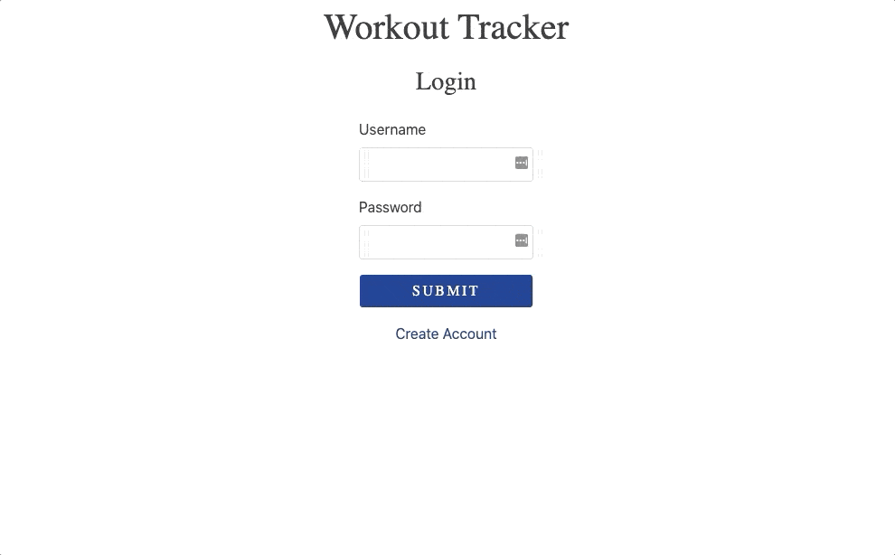

# Workout Tracker

This application will enable you to view, create, and track daily workouts with the ability to log any exercise information or notes needed.

## Click [Here](https://kingsleyramos-burger.herokuapp.com/) for deployed application.
---

## Usage
---
1. Start by creating an account
2. Login using those account credentials
3. click Create New Workout
4. Fill out the title and workout, then click Save
5. Click on any saved workout to view or edit.

## Tool & Resources
---
* [Bootstrap](https://getbootstrap.com/) - CSS framework used
* [JQuery](https://getbootstrap.com/) - JavaScript library used
* [Heroku](https://www.heroku.com/) - Used to deploy the application and the NoSQL database
    ### Dependencies
    ---
    * [Express](https://expressjs.com/) - Node Framework used
    * [Handlebars](https://handlebarsjs.com/) - Templating Engine used
    * [mongojs](https://www.npmjs.com/package/mongojs) - Used to connect to the NoSQL database and perform queries
    * [mongoose]() - ODM used
    * [morgan]() - Used to log requests
    * [passport]() - Used to manage authentication
    * [passport-local]() - Used to manage the type of authentication
    * [bcrypt-nodejs]() - To encrypt credentials.
